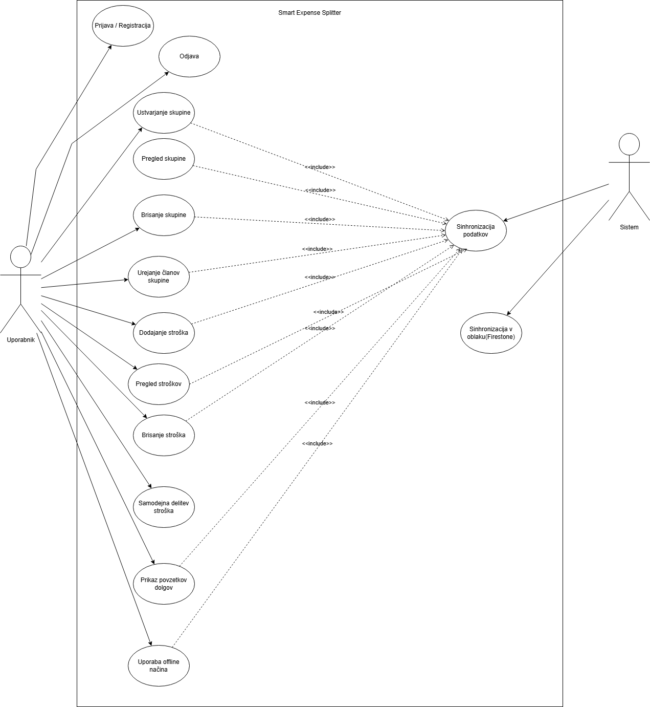

# Smart Expense Splitter

Smart Expense Splitter je mobilna aplikacija, namenjena enostavni delitvi stroškov med prijatelji, sostanovalci, partnerji ali študentskimi skupinami.  
Aplikacija uporablja:

- **Flutter** (UI in logika)
- **Firebase Auth & Firestore** (avtentikacija + oblak)
- **SQLite** (offline način)

---

# 📑 Kazalo

1. [Opis projekta](#opis-projekta)  
2. [Ključne funkcionalnosti](#ključne-funkcionalnosti)  
3. [Struktura projekta](#struktura-projekta)  
4. [Use-Case Diagram](#use-case-diagram)
5. [ER Diagram](#er-diagram)
6. [Prvi koraki](#prvi-koraki)  
   - [Predpogoji](#predpogoji)  
   - [Namestitev](#namestitev)  
   - [Kloniranje repozitorija](#kloniranje-repozitorija)  
   - [Nastavitev Firebase](#nastavitev-firebase)  
   - [Nastavitev SQLite](#nastavitev-sqlite)  
   - [Zagon aplikacije](#zagon-aplikacije)  
7. [Avtorji](#avtorji)  
8. [Licenca](#licenca)

---

# 📘 Opis projekta

Smart Expense Splitter omogoča uporabnikom:

- ustvarjanje skupin,
- dodajanje stroškov,
- avtomatsko delitev stroškov,
- spremljanje dolgov,
- uporabo brez internetne povezave (SQLite),
- sinhronizacijo podatkov v oblak (Firestore).

---

# 🔑 Ključne funkcionalnosti

### 🔐 Avtentikacija (Firebase Auth)
- Prijava / registracija
- Podpora anonimni prijavi

### 👥 Upravljanje skupin
- Ustvarjanje in urejanje skupine
- Dodajanje članov

### ➕ Stroški
- Dodajanje stroškov
- Določanje deležev
- Različni načini delitve (enakovredno, odstotki, zneski)

### 📊 Povzetek dolgov
- Pregled terjatev in dolgov
- Neto stanje
- Optimizacija poravnav

### ☁️ Sinhronizacija
- Firebase Firestore za oblak
- Avtomatska sinhronizacija, ko je internet na voljo

### 📡 Offline način
- SQLite shrani podatke lokalno
- Aplikacija deluje popolnoma tudi brez interneta

---

# 🗂️ Struktura projekta
```bash
project-root/
│
├── android/                                    # Android projektna mapa (JNI, manifesti, gradle, build)
│   └── app/                                     # Android aplikacija, vsebuje google-services.json itd.
│
├── ios/                                        # iOS projekt (Runner), plist datoteke, Firebase config
│
├── web/                                        # Web build podpora (če se gradi Flutter web)
│
├── linux/                                      # Podpora za Linux (če je omogočeno)
│
├── macos/                                      # Podpora za macOS aplikacijo
│
├── windows/                                    # Podpora za Windows build
│
├── lib/                                        # Glavna mapa Flutter kode (Dart datoteke)
│   ├── screens/                                 # UI zasloni (Login, GroupScreen, ExpenseScreen…)
│   │   └── *.dart                               # Posamezni zasloni aplikacije
│   │
│   ├── widgets/                                 # Ponovno uporabni gradniki (Buttons, Cards, Inputs…)
│   │   └── *.dart                               # Flutter widgeti
│   │
│   ├── main.dart                                # Vhodna točka aplikacije (runApp)
│   └── theme.dart                               # Globalna tema, barve, tipografija
│
├── test/                                       # Widget testi in enotni testi
│   └── *.dart                                   # Testne datoteke
│
├── .dart_tool/                                 # Interna orodja Flutterja (samodejno generirano)
│   └── *                                        # Ne spreminjaj — uporablja Flutter tooling
│
├── .gitignore                                   # Datoteke, ki jih GIT ignorira
│
├── pubspec.yaml                                 # Glavni config za odvisnosti (Firebase, sqflite, UI paketi…)
├── pubspec.lock                                 # Zaklenjene verzije odvisnosti
│
├── analysis_options.yaml                        # Pravila za lintanje / analizo kode
│
├── README.md                                    # Dokumentacija projekta (pripraviš svojo)
└── .metadata                                    # Flutter metadata o projektu (samodejno generirano)

```

# 🧩 Use-Case Diagram


# 🌐 ER Diagram
!-------Caksy tu dodaj png od diagrama 

# 🔽 Namestitev
- Kloniranje repozitorija:
```bash
git clone https://github.com/<tvoj-username>/SmartExpenseSplitter.git
cd SmartExpenseSplitter
```

# 🔥 Nastavitev Firebase
1. Ustvari Firebase projekt:
https://console.firebase.google.com/
2. Aktiviraj:
- Authentication (Email/Password + Anonymous)
- Firestore (Native mode)
3. Dodaj Android/iOS aplikacijo:
- Vnesi package name
- Prenesi google-services.json (Android)
- Prenesi GoogleService-Info.plist (iOS)
4. Kopiraj datoteke v projekte:
  - Android:
    ```bash
    android/app/google-services.json
    ```
  - iOS
     ```bash
    ios/Runner/GoogleService-Info.plist
    ```
5. Vključi Firebase v Flutter:
   ```bash
    flutter pub add firebase_core firebase_auth cloud_firestore
    flutterfire configure
    ```


# 🗄️ Nastavitev SQLite
- SQLite deluje samodejno z uporabo paketa, torej v .yaml dodate:
   ```bash
    sqflite: ^2.0.0
    path_provider: ^2.0.0
    ```


# ▶️ Zagon aplikacije
- Na emulatorju ali telefonu:
    ```bash
    flutter run
    ```
- V primeru da imate več naprav:
  ```bash
    flutter devices
    flutter run -d <device_id>
    ```
# 👨‍💻 Avtorji
- Nnamdi Ambrose Junior Eze
- Miha Čaks
- Matej Filipov

# 📄 Licenca
MIT License © 2025
